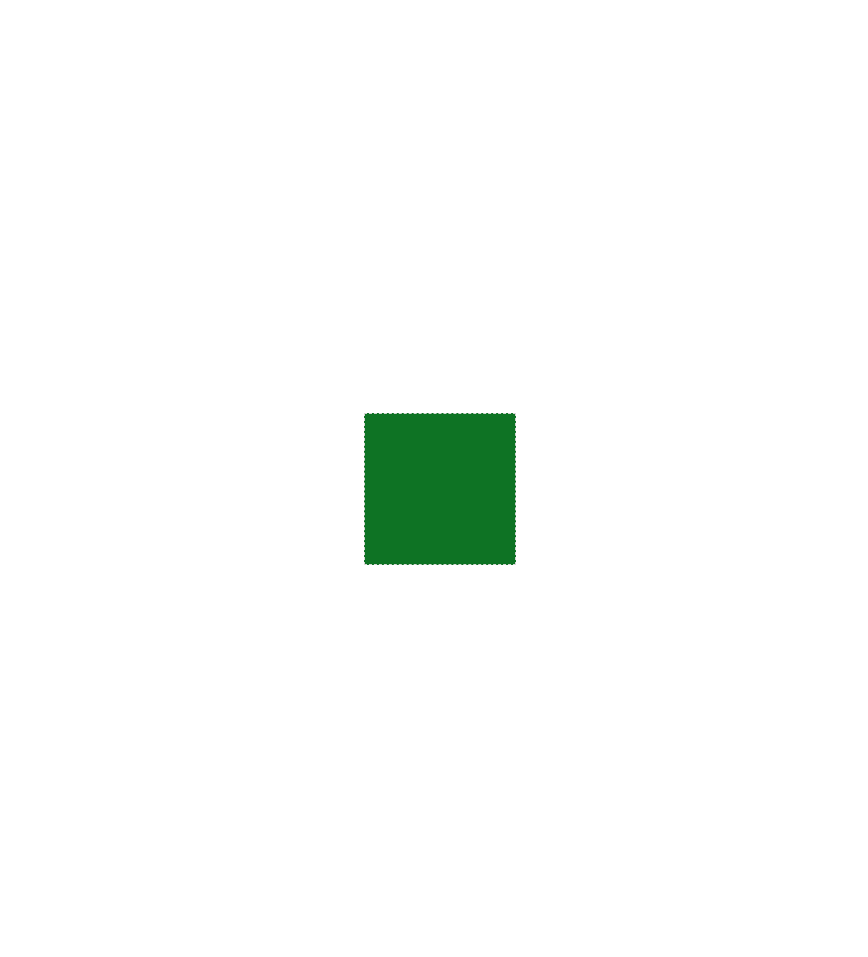
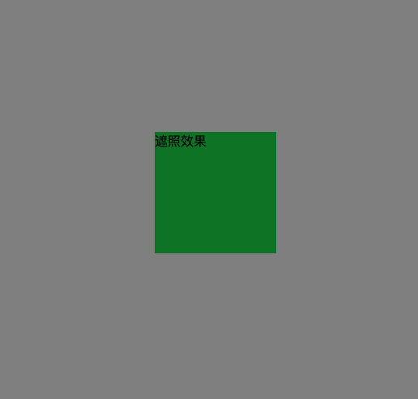
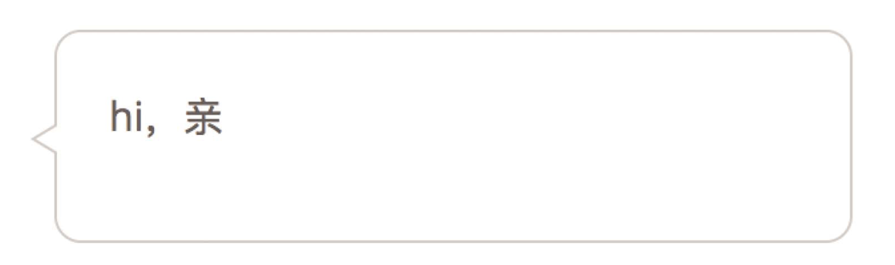
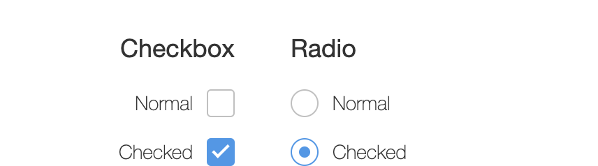
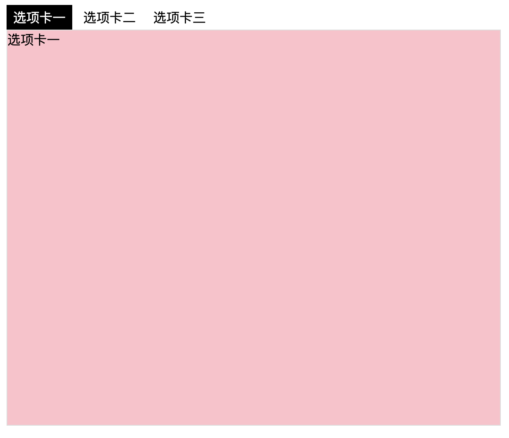

- [1题](#task1)
- [2题](#task2)
- [3题](#task3)
- [4题](#task4)
- [5题](#task5)
- [6题](#task6)
- [7题](#task7)
- [8题](#task8)

<a id = "task1"></a>
# 第一题 

```
    分割线
```
<a id = "task2"></a>
# 第二题


```
   宽度为 500

   背景色 黑色
   透明度 .5

   小圆点 背景色 gray 

```

<a id = "task3"></a>
# 第三题

```
    宽度 高度 为 150px 的盒子
    背景色为green
    在水平方向 和 垂直方向 
    居中显示
```
<a id = "task4"></a>
# 第四题

```
    在第三题的基础上加一个遮照效果
    背景色 为 green的盒子 在 遮照效果之上
```
<a id = "task5"></a>
# 第五题


```
    要求 ： 鼠标经过 绿色 背景边框 显示 红色背景边框

    绿色背景边框 宽度 高度 都是100
    红色背景边框 宽度 100

```
<a id = "task6"></a>
# 第六题


```
    聊天框

```
<a id = "task7"></a>
# 第七题


```
    单选框和多选框 美化

```
<a id = "task8"></a>
# 第八题


```
    tab选项卡

```